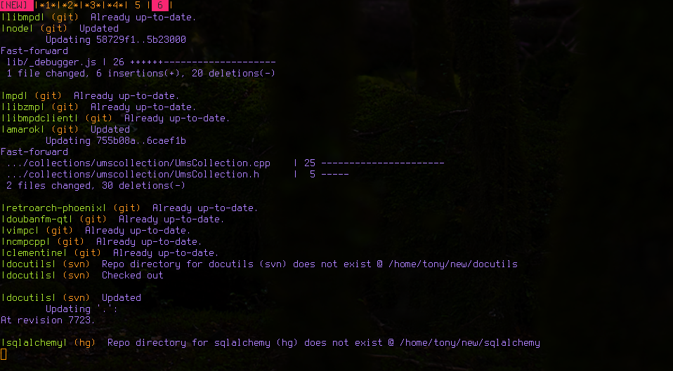

=====
pullv
=====

.. sidebar:: Contents

    .. toctree::
        :maxdepth: 2

        quickstart
        examples
        api
        changes
        todo..

    Run ``svn update``, ``git pull``, ``hg pull && hg update`` en masse.

.. include:: ../README.rst
    :start-line: 10

Indices and tables
==================

* :ref:`genindex`
* :ref:`modindex`
* :ref:`search`
